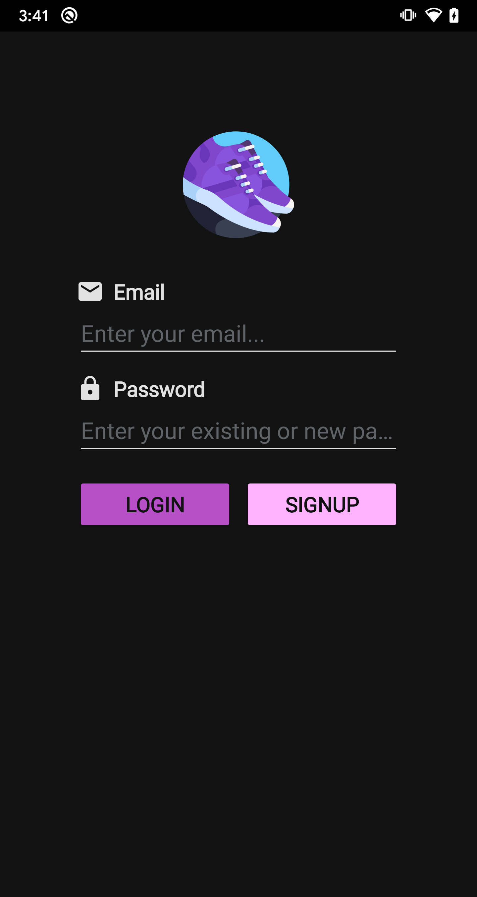
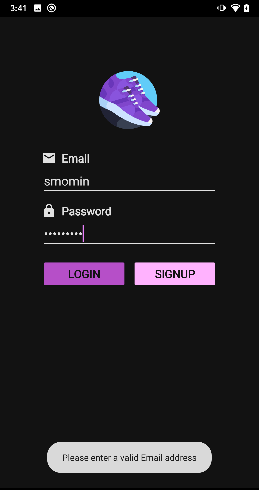
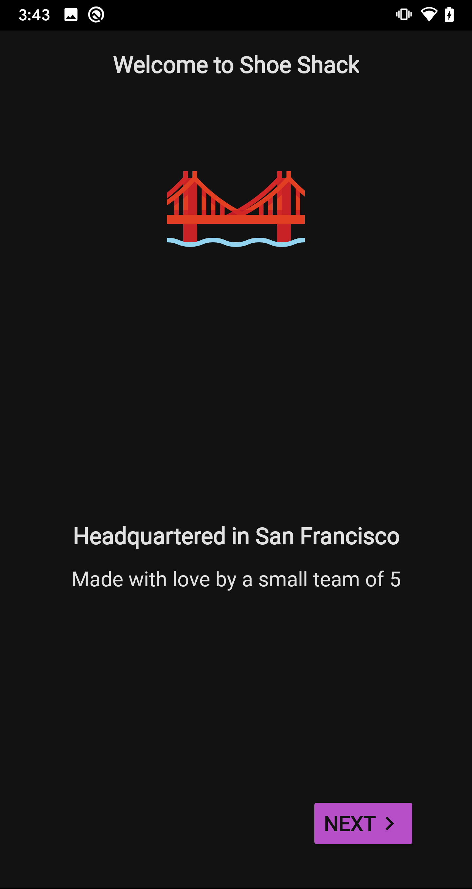
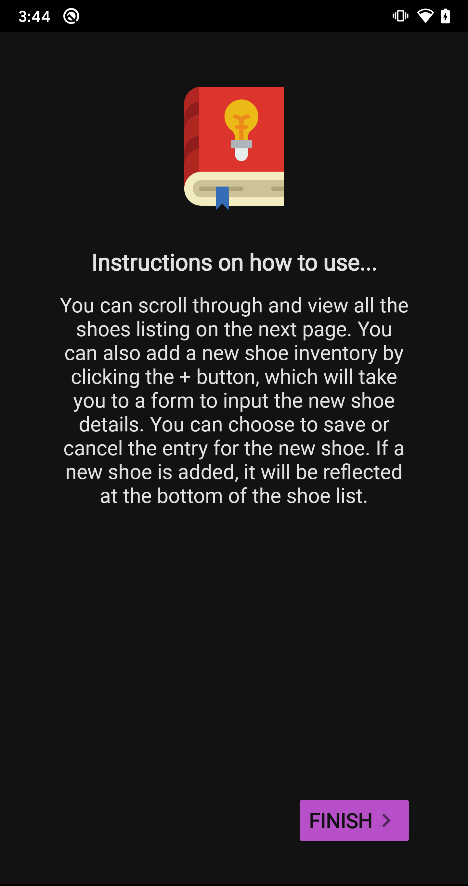
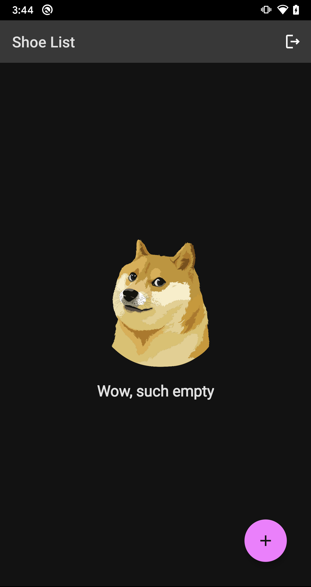
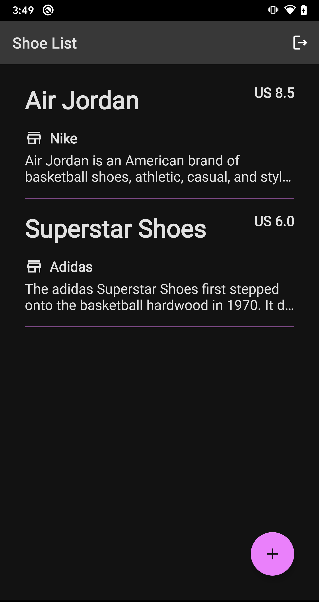
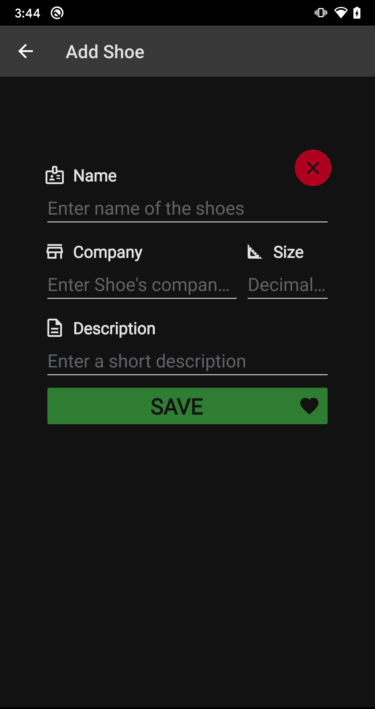

# Shoe Shack

One stop solution to maintain any shoe inventory

### Screens

#### Login
| Login      | Login Error |
| ----------- | ----------- |
|||

#### Onboarding
| Welcome Slide 1 | Welcome Slide 2 | Welcome Slide 3 |
| ----------- | ----------- | ----------- |
||||

#### Insctruction
| How to      |
| ----------- |
||

#### Shoe List
| Empty      | With Shoes |
| ----------- | ----------- |
|||

#### Insctruction
| Shoe Detail Form |
| ----------- |
||

## Getting Started

```
cd workspace
git clone https://github.com/Saifil/android-nd-project-1-shoe-store.git
cd android-nd-project-1-shoe-store
open .
```

### Installation

- Install Android Studio (<b>version >= 3.6.1</b>)
- Open [`starter`](https://github.com/Saifil/android-nd-project-1-shoe-store/tree/master/starter) project in Android Studio
- The app will take a while when building gradle for the very first time
- Run the project to install app on physical android device / emulator
    - Min supported android version is <b>API 22</b>

## Project Instructions

Project deliverable
```
android-nd-project-1-shoe-store/starter
```

## Built With

### Android components
* [Data Binding](https://developer.android.com/topic/libraries/data-binding)
* [Navigation Component](https://developer.android.com/guide/navigation/navigation-getting-started)
* [Lifecycle](https://developer.android.com/jetpack/androidx/releases/lifecycle)
    * [LiveData](https://developer.android.com/topic/libraries/architecture/livedata)
    * [ViewModel](https://developer.android.com/topic/libraries/architecture/viewmodel)
* [ViewPager2](https://developer.android.com/jetpack/androidx/releases/viewpager2)

## Future Work

- Add image support for shoe details
- Add paging dots for onboarding slides

## License

[MIT License](LICENSE) &copy; Shoe Shack
